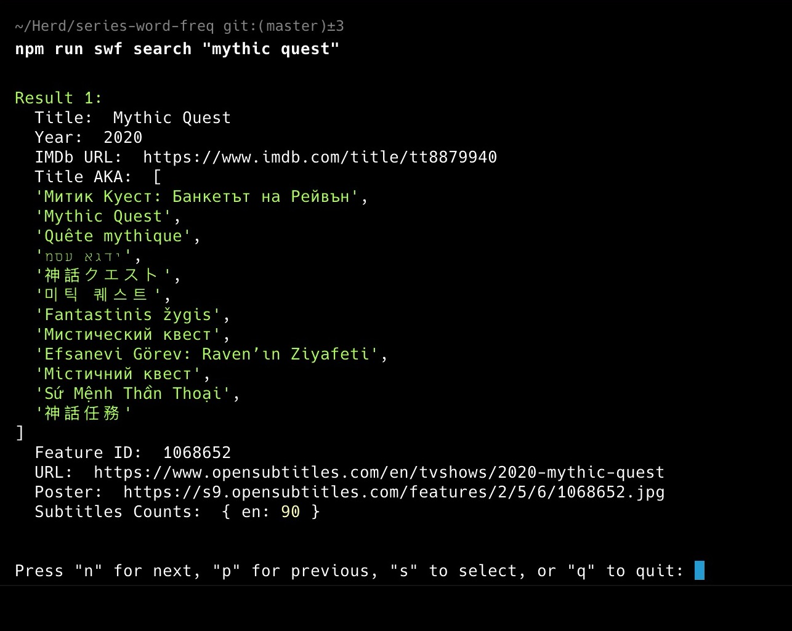
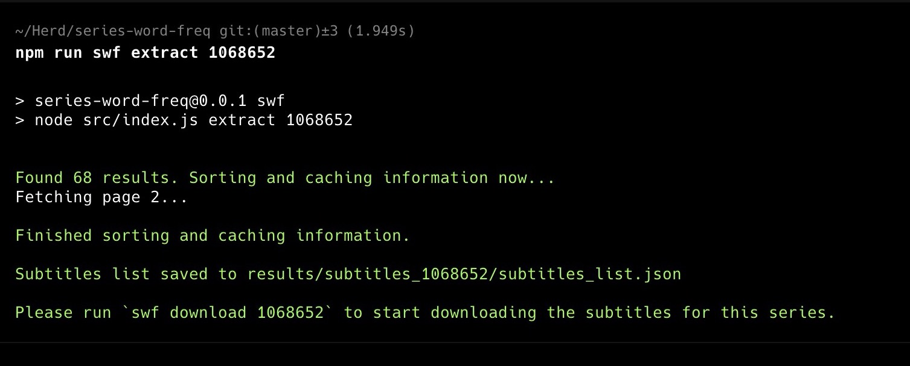
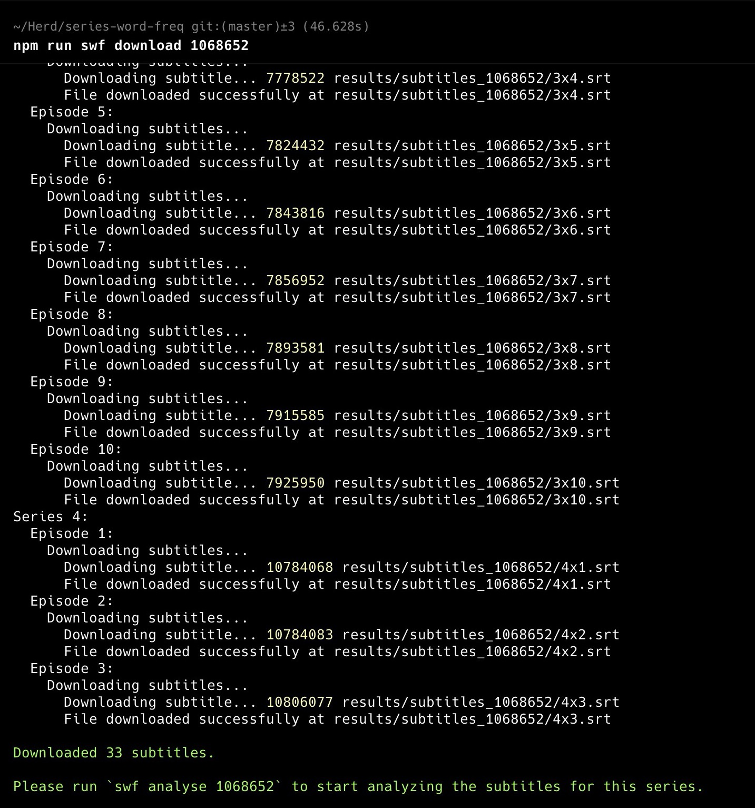
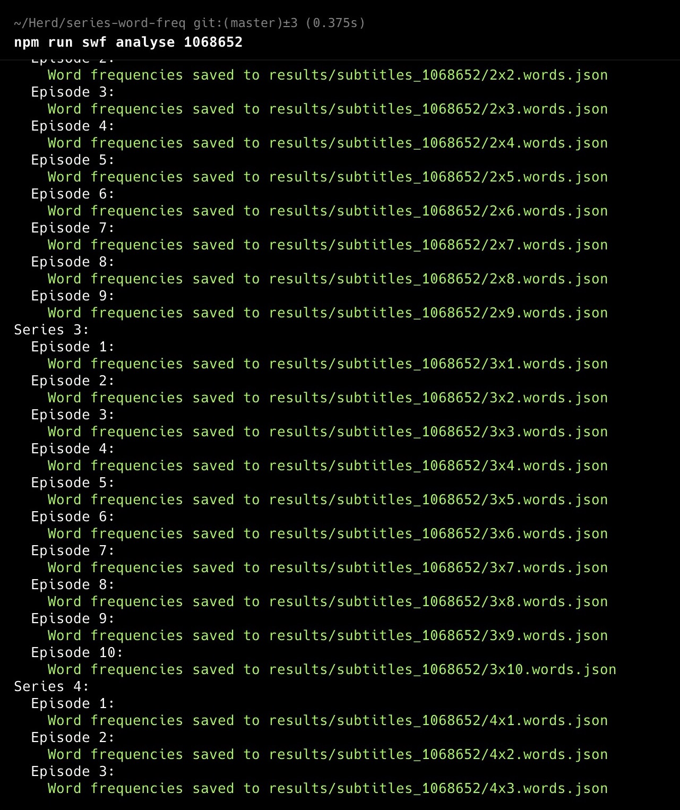
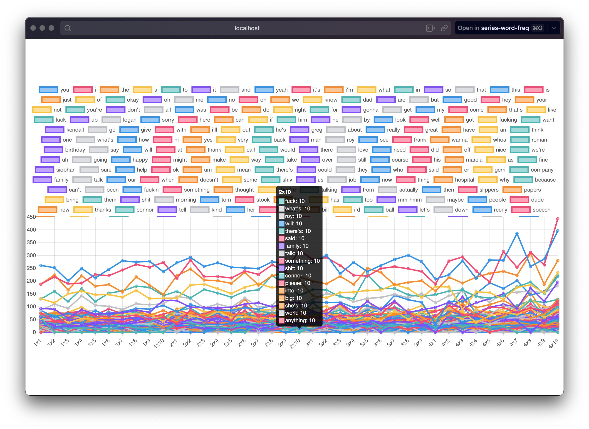
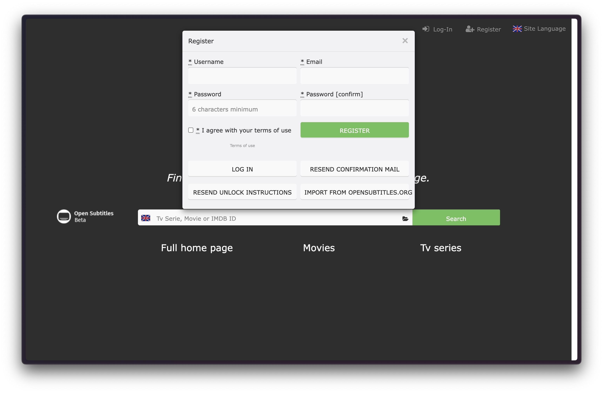
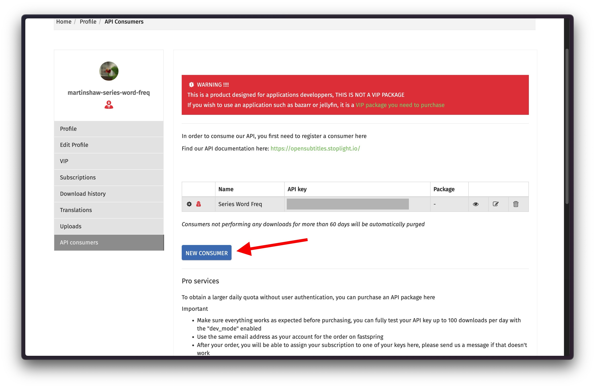
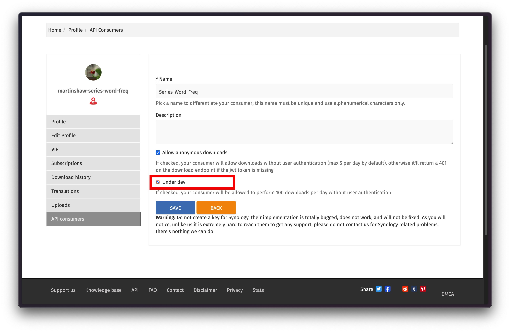

# series-word-freq

## Magically create interactive graphs of word frequency in a TV series

Uses the OpenSubtitles API to download subtitle files for a series then we analyse the frequency of words in the subtitles to create an interactive graph of word frequency.

### Table of Contents
[ 1. Story behind this project](#story-behind-this-project)  
[ 2. Usage](#usage)  
[ 3. Screenshots](#screenshots)  
[ 4. OpenSubtitles API](#opensubtitles-api)

## Story behind this project

I saw this [Reddit post](https://old.reddit.com/r/SeveranceAppleTVPlus/comments/1ijju2m/data_visualizing_who_talks_when_by_episode/) which I found intriguing. I wanted to see if I could create something similar but for any TV series.

I decided to aim at a deadline of 2 hours to complete a simple MVP implementation of this project idea from start at 1:30am finishing at 3:30am. I managed to complete the project in 7 hours and 30 minutes finishing at 9:00am. I am very happy with the result and I hope you find it useful.

> "Work expands so as to fill the time available for its completion" - [Parkinson's Law](https://en.wikipedia.org/wiki/Parkinson%27s_law)

## Usage

1. Install Node.js (https://nodejs.org/)

2. Clone this repository `git clone git@github.com:martinshaw/series-word-freq.git` or download the [zip file](https://github.com/martinshaw/series-word-freq/archive/refs/heads/master.zip) and extract it.

3. Install the dependencies by running `npm install` in the project directory.

4. Run `npm run swf login` to login to the OpenSubtitles API. You will need to create an account at https://www.opensubtitles.org/ and get a username, password and an API key. You will be prompted to enter these details or you can add them manually to a `.env` file. Choose a password that doesn't contain double quotes.

4. Run `npm run swf search "series"` to search for a series. Replace `"series"` with the name of the series you want to search for.

5. Browse through the shows using `n` and `p` to move to the next and previous pages. When you find the show you want, press `s`. Press `q` to quit.

6. Run the mentioned command `npm run swf extract 12345` to extract the subtitles for the show. Replace `12345` with the ID of the show you want to extract.

7. Run the mentioned command `npm run swf download 12345` to download the subtitles for the show.

8. Run the mentioned command `npm run swf analyse 12345` to analyse the subtitles for the show.

9. Run the mentioned command `npm run swf chart 12345` to generate a .png image of the word frequency graph for the show.

10. Run the mentioned command `npm run swf interactive 12345` to serve an interactive word frequency graph for the show on a local server at http://localhost:5000.

11. Run the mentioned command `npm run swf ls` or `npm run swf list` to list the shows you have analysed.

## Screenshots

## OpenSubtitles API

If you need more help setting up series-word-freq with the OpenSubtitles API. Please follow these simple steps:

1. Create an account at https://www.opensubtitles.org/

2. Login to your account and go to the 'API Consumers' page.

3. Create a new API Key (Consumer). If you are using this for development etc..., you should tick 'Under dev' as this gives you a generous limit of download requests.

